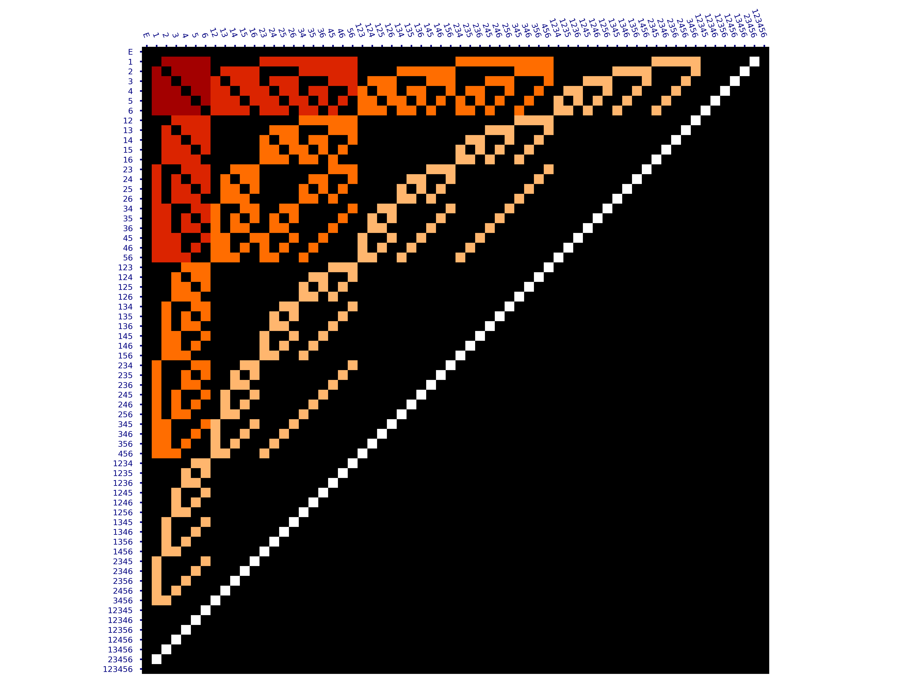
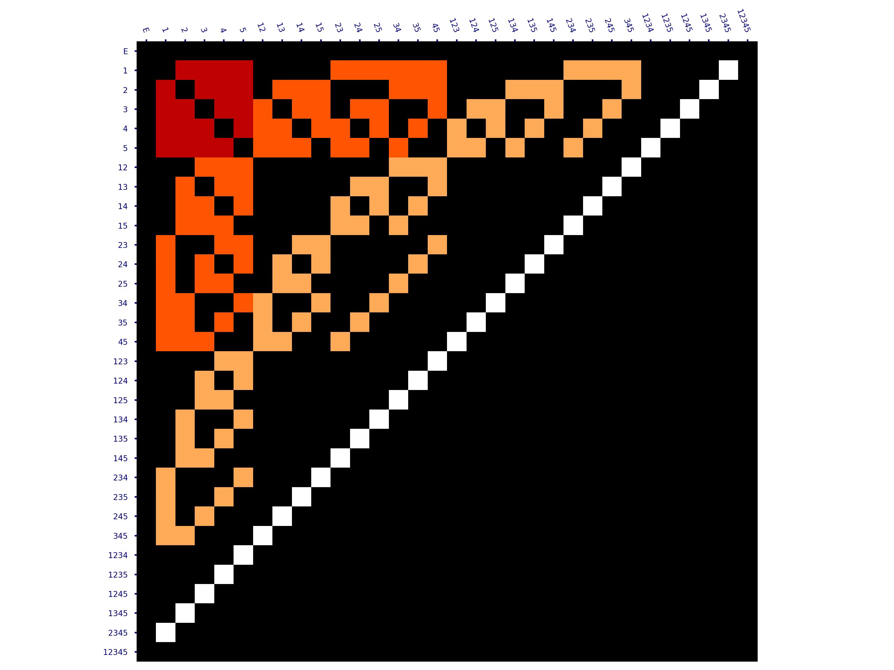

# LiZhongYuan diagram generate code

LiZhongYuan diagram is a special Cayley table for complete sequential operation in paper "Optional intervals event, sequential operation and their applications in physics, computer science and applied mathematics".

# Pictures
## 8-Dimensions LiZhongYuan diagram

## 7-Dimensions LiZhongYuan diagram

## 6-Dimensions LiZhongYuan diagram

## 5-Dimensions LiZhongYuan diagram

# The paper links

## Arxiv
<https://arxiv.org/abs/2504.09471>

## Alphaxiv
<https://www.alphaxiv.org/abs/2504.09471>
