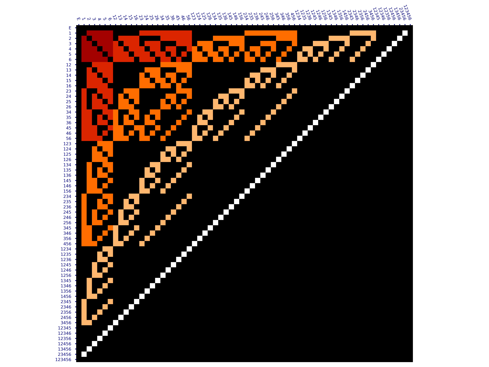
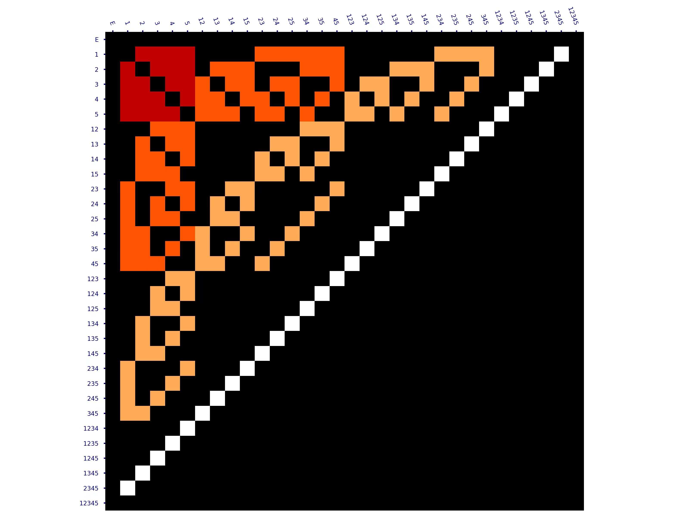

# LiZhongYuan diagram generate code

LiZhongYuan diagram is a special Cayley table for complete sequential addition in paper "Optional Intervals Event and Two n-ary Finitary Operations: An Algebraic Framework for Unifying Parallel-Serial Execution and Axiomatizing Simultaneity from an Epistemological Perspective".

# Pictures
## 8-Dimensions LiZhongyuan diagram

## 7-Dimensions LiZhongYuan diagram

## 6-Dimensions LiZhongYuan diagram

## 5-Dimensions LiZhongYuan diagram

# The paper links

## Arxiv
<https://arxiv.org/abs/2504.09471>

## Alphaxiv
<https://www.alphaxiv.org/abs/2504.09471>
